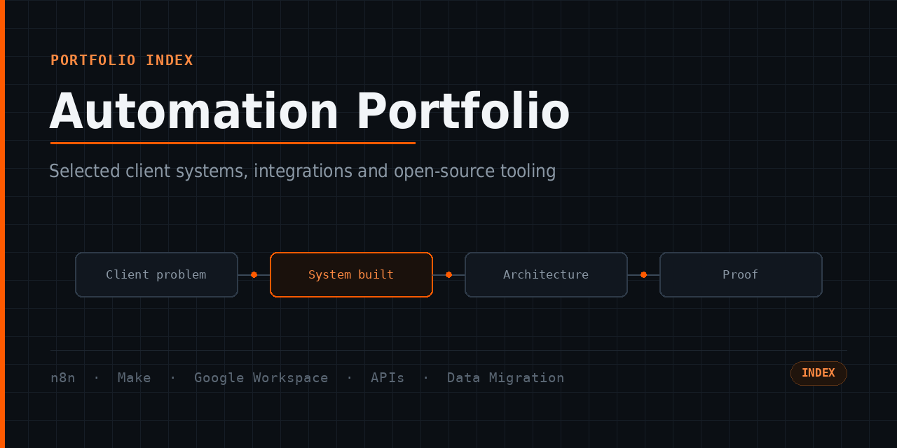
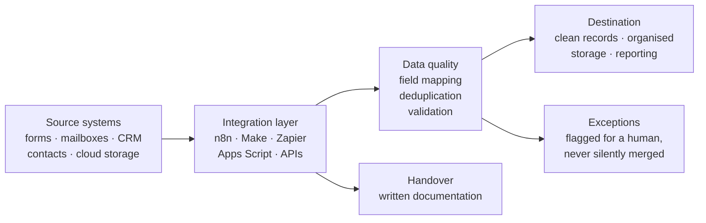
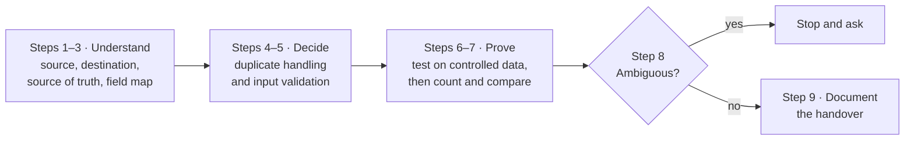

# Automation Portfolio

**Automation · Integrations · Business Systems**
n8n · Make · Zapier · Google Workspace · Apps Script · APIs & Webhooks · Data Migration

The full index of my work, organised by discipline. Each entry states the business
problem, the system built, the real stack, and what evidence exists that it was
delivered.

Nothing here is a mock-up. Where implementation detail is missing it is because the
production system belongs to a client — never because it is being embellished. Labs
and patterns repositories are labelled as such and are never presented as client work.

[Upwork](https://www.upwork.com/freelancers/skmalik1) · [Fiverr](https://www.fiverr.com/skmalik166) · [GitHub profile](https://github.com/skmalikllc)

---

## How to read the labels

| Label | Meaning |
|---|---|
| `OPEN-SOURCE UTILITY` | Written and published by me. Code is here, tests run on every push. |
| `SANITIZED CLIENT CASE STUDY` | Completed paid work, described without client names, data, credentials or proprietary code. |
| `CLIENT ENGAGEMENT RECORD` | Completed paid work recorded truthfully where the implementation detail is private. |
| `TECHNICAL LAB` | My own code, written for the portfolio. **Not client work.** |
| `WORKFLOW PATTERNS` / `DIAGNOSTIC METHOD` | How I design and debug. Real engagements are named where they illustrate a point. |
| `OPERATIONS PORTFOLIO` / `ENGAGEMENT RECORD` | Real delivered work summarised without a technical write-up. |

---

## What I build

Detailed architecture diagrams live in each project's own repository.

---

# 1. Workflow Automation

| Repository | What it is |
|---|---|
| **[automation-client-case-studies](https://github.com/skmalikllc/automation-client-case-studies)** `SANITIZED CLIENT CASE STUDIES` | n8n, Make and Zapier builds, plus the jobs that arrive already broken. Includes the **stale Airtable View ID** diagnostic — the shape most "my automation stopped working" jobs take. **Proof:** a 5.0-rated Upwork n8n build delivered ahead of schedule, plus Fiverr automation orders with client reviews. |
| **[n8n-google-contacts-backup](https://github.com/skmalikllc/n8n-google-contacts-backup)** `SANITIZED CLIENT CASE STUDY` | A scheduled n8n workflow capturing the contact list a business runs on, so a bad day is recoverable. **Proof:** completed Upwork contract, client-rated **5.0**, listed as an Upwork Profile Highlight. |
| **[workflow-automation-patterns](https://github.com/skmalikllc/workflow-automation-patterns)** `WORKFLOW PATTERNS` | How I design these: trigger choice, retries that only retry what a retry can fix, idempotency, boundary validation, human-review steps, run logging, and treating every external ID as a dependency. |

---

# 2. Google Workspace

| Repository | What it is |
|---|---|
| **[google-workspace-apps-script-automation](https://github.com/skmalikllc/google-workspace-apps-script-automation)** `SANITIZED CLIENT CASE STUDIES` | Apps Script repaired and extended inside client spreadsheets; Workspace admin troubleshooting; and a **617-question conditional intake form generated programmatically** because it was far too large to build by hand. **Proof:** completed Upwork contracts, 5.0 rated. |
| **[gmail-business-inbox-organization](https://github.com/skmalikllc/gmail-business-inbox-organization)** `SANITIZED CLIENT CASE STUDIES` | Overloaded mailboxes turned back into a working queue — label scheme, backlog sorted into it, filters so new mail arrives already sorted. On one engagement the binding constraint was that **live operational mail had to stay visible in the Inbox**, which rules out the usual "filter everything away" approach. **Proof:** four Gmail engagements, all 5 stars, 1–9 day turnarounds, two became ongoing relationships; plus a Microsoft 365 engagement. |
| **[google-workspace-automation-lab](https://github.com/skmalikllc/google-workspace-automation-lab)** `TECHNICAL LAB` | Six readable Apps Script building blocks — idempotent Drive folder trees, regenerated Sheets reports, bounded Gmail label rules with a preview mode, form-response validation, Docs→PDF from a template, and trigger management that deletes before it creates. **My code, not a client's.** |

---

# 3. API & Integrations

| Repository | What it is |
|---|---|
| **[api-webhook-integration-patterns](https://github.com/skmalikllc/api-webhook-integration-patterns)** `TECHNICAL LAB` |  Dependency-free Node.js reference implementations for the six things that separate a demo from a system: boundary validation, declarative field mapping, retry with full jitter, idempotency, HMAC webhook verification with a replay window, and a redacting structured logger. **31 unit tests plus a worked end-to-end example**, CI on Node 20/22/24. |
| **[table-to-sheets](https://github.com/skmalikllc/table-to-sheets)** `OPEN-SOURCE UTILITY` | Getting data *out* of a system that will not export it — any HTML table into RFC 4180 CSV or a Google Sheets paste, merged cells expanded first. |

---

# 4. Data Sync, Deduplication & Reconciliation

| Repository | What it is |
|---|---|
| **[data-sync-dedup-reconciliation](https://github.com/skmalikllc/data-sync-dedup-reconciliation)** `METHOD + CASE INDEX` | The thread running through most of what I am hired for: two systems that are supposed to agree and do not. Profile → source of truth → field map → match with evidence → merge conservatively → reconcile → report. Ties the engagements below together. |
| **[contact-dedupe-mcp](https://github.com/skmalikllc/contact-dedupe-mcp)** `OPEN-SOURCE UTILITY` |  An MCP server that profiles a contact export, finds the rows that are the same person **with the evidence for each match**, merges them, and reports every conflicting value instead of silently picking one. 9 unit tests + an end-to-end test, CI on Node 20/22/24. |
| **[icloud-google-contacts-sync](https://github.com/skmalikllc/icloud-google-contacts-sync)** `SANITIZED CLIENT CASE STUDY` | Two address books that had quietly stopped agreeing, reconciled rather than imported over the top. **Proof:** completed Upwork contract, client-rated **5.0**; the client's own review says it worked *"across systems without any data loss or duplication"*. |

---

# 5. Airtable & Client Systems

| Repository | What it is |
|---|---|
| **[airtable-systems-portfolio](https://github.com/skmalikllc/airtable-systems-portfolio)** `CLIENT ENGAGEMENT RECORD` | **Three completed Airtable client projects.** Internals are private, and the page says so rather than inventing them. What *is* documented: how I approach a base, why external IDs are dependencies, and duplicate prevention — where an exact key is authoritative, a name is not, and a name-only match warns rather than merges. |
| **[jotform-client-intake-automation](https://github.com/skmalikllc/jotform-client-intake-automation)** `SANITIZED CLIENT CASE STUDY` | The form a business collects its work through, built to specification. **Proof:** completed Fiverr orders including one in the $400–$600 range, and a public 5-star review. *Downstream integrations are deliberately not claimed.* |

---

# 6. Cloud Migration

| Repository | What it is |
|---|---|
| **[cloud-file-migration-case-studies](https://github.com/skmalikllc/cloud-file-migration-case-studies)** `SANITIZED CLIENT CASE STUDIES` | Moving file estates between providers with their structure intact — Google Drive, OneDrive, Dropbox and Mega — plus file architecture for drives that stayed where they were. The method: inventory what is really there → agree in writing what must survive → dry run with no writes → transfer in batches, never overwriting → reconcile file by file → escalate anything ambiguous. **Proof:** multiple completed engagements across Upwork and Fiverr, 2023–2025. |

---

# 7. AI / Modern Automation

| Repository | What it is |
|---|---|
| **[contact-dedupe-mcp](https://github.com/skmalikllc/contact-dedupe-mcp)** `OPEN-SOURCE UTILITY` | A **Model Context Protocol** server over stdio, so the cleanup happens inside a conversation with Claude rather than by hand in a spreadsheet. Tool definitions, zod schemas and an end-to-end MCP client test. |

**Scope, stated plainly.** MCP tooling is the part of this area I have actually built
and published. I am **not** claiming completed client projects in OpenAI vector-store
assistants, Discord automation, or AI agent systems — no verified delivery evidence
exists for those, so they are not on this page.

---

# 8. Open-Source Utilities

| Repository | Tests | What it is |
|---|---|---|
| **[contact-dedupe-mcp](https://github.com/skmalikllc/contact-dedupe-mcp)** |  | Evidence-based contact deduplication as an MCP server. |
| **[table-to-sheets](https://github.com/skmalikllc/table-to-sheets)** |  | Chrome MV3 extension: any HTML table → CSV or Google Sheets, `rowspan`/`colspan` expanded into a true matrix first. |
| **[api-webhook-integration-patterns](https://github.com/skmalikllc/api-webhook-integration-patterns)** |  | Integration primitives with 31 tests and a runnable example. |

Every badge above is a real workflow. None of them are decorative.

---

# 9. Business Operations Systems

| Repository | What it is |
|---|---|
| **[business-operations-systems](https://github.com/skmalikllc/business-operations-systems)** `OPERATIONS PORTFOLIO` | The operational layer a small business runs on — intake, records, routing, file architecture, follow-up, reporting, handover — with each layer linked to the engagement that delivered it. Not a virtual-assistant page. |
| **[technical-troubleshooting-case-studies](https://github.com/skmalikllc/technical-troubleshooting-case-studies)** `DIAGNOSTIC METHOD` | Diagnosing systems somebody else built: reproduce before you change, distrust the error message, check every external reference, isolate, fix the cause. Illustrated with five completed engagements. |

---

# 10. E-commerce Operations

| Repository | What it is |
|---|---|
| **[ecommerce-operations-portfolio](https://github.com/skmalikllc/ecommerce-operations-portfolio)** `OPERATIONS PORTFOLIO` | Catalogue and store operations across Amazon, eBay, Etsy, Shopify and WooCommerce — listings, product data, imagery, marketplace SEO, store admin — delivered repeatedly at five stars on Fiverr. Includes WordPress/WooCommerce at an **operations** level; plugin and theme development are explicitly not claimed. |
| **[digital-operations-portfolio](https://github.com/skmalikllc/digital-operations-portfolio)** `ENGAGEMENT RECORD` | The wider earlier freelance record: real-estate support, e-learning setup, a staffing cost analysis, a scripted SOP-to-Word pipeline in Node.js, and an Excel workbook converted into a fully offline HTML dashboard for an air-gapped PC. |

---

# 11. Professional Background

Twenty years of structured technical operations, maintenance documentation,
supervision and training, followed by ten-plus years of freelance client work. That
first track is **operations and documentation discipline — it is not software
engineering**, and nothing in this portfolio presents it as such.

Full background and timeline: **[github.com/skmalikllc](https://github.com/skmalikllc)**.

---

# Skills

Grouped by discipline, with the repository that evidences each group. Nothing in this
table is claimed without something on this page behind it.

| Group | Skills | Evidenced in |
|---|---|---|
| **Workflow Automation** | n8n · Make.com · Zapier · workflow design · triggers · scheduling · conditional logic · error handling · workflow troubleshooting | [automation-client-case-studies](https://github.com/skmalikllc/automation-client-case-studies) · [n8n-google-contacts-backup](https://github.com/skmalikllc/n8n-google-contacts-backup) · [workflow-automation-patterns](https://github.com/skmalikllc/workflow-automation-patterns) |
| **Google Workspace** | Google Workspace · Sheets · Apps Script · Drive · Gmail · Contacts · Forms · Docs · Workspace admin troubleshooting | [google-workspace-apps-script-automation](https://github.com/skmalikllc/google-workspace-apps-script-automation) · [gmail-business-inbox-organization](https://github.com/skmalikllc/gmail-business-inbox-organization) · [google-workspace-automation-lab](https://github.com/skmalikllc/google-workspace-automation-lab) |
| **APIs & Integrations** | REST APIs · webhooks · JSON · data mapping · request/response troubleshooting · HMAC signature verification · retries · idempotency | [api-webhook-integration-patterns](https://github.com/skmalikllc/api-webhook-integration-patterns) · [automation-client-case-studies](https://github.com/skmalikllc/automation-client-case-studies) |
| **Data & Migration** | data migration · synchronisation · contact sync · deduplication · reconciliation · data cleanup · CSV · Excel · duplicate prevention · file migration · folder architecture | [data-sync-dedup-reconciliation](https://github.com/skmalikllc/data-sync-dedup-reconciliation) · [contact-dedupe-mcp](https://github.com/skmalikllc/contact-dedupe-mcp) · [cloud-file-migration-case-studies](https://github.com/skmalikllc/cloud-file-migration-case-studies) |
| **Databases & Client Systems** | Airtable · CRM workflows · Jotform · client intake · form workflows · database operations · CRM data cleanup | [airtable-systems-portfolio](https://github.com/skmalikllc/airtable-systems-portfolio) · [jotform-client-intake-automation](https://github.com/skmalikllc/jotform-client-intake-automation) |
| **AI / Modern Automation** | Model Context Protocol (MCP) · AI-assisted data workflows · tool schemas | [contact-dedupe-mcp](https://github.com/skmalikllc/contact-dedupe-mcp) |
| **Development** | JavaScript · Node.js · Chrome Extensions (MV3) · GitHub Actions · `node:test` · scripting · Python (supporting) | [table-to-sheets](https://github.com/skmalikllc/table-to-sheets) · [api-webhook-integration-patterns](https://github.com/skmalikllc/api-webhook-integration-patterns) · [contact-dedupe-mcp](https://github.com/skmalikllc/contact-dedupe-mcp) |
| **Cloud & File Systems** | Google Drive · OneDrive · Dropbox · Mega · cloud migration · file organisation · folder architecture · migration verification | [cloud-file-migration-case-studies](https://github.com/skmalikllc/cloud-file-migration-case-studies) |
| **Business Operations** | documentation · document control · reporting · email management · file management · administrative systems · data management · project coordination · process improvement · client follow-up | [business-operations-systems](https://github.com/skmalikllc/business-operations-systems) · [digital-operations-portfolio](https://github.com/skmalikllc/digital-operations-portfolio) |
| **E-commerce** | Amazon · eBay · Etsy · Shopify · WooCommerce · WordPress · product and catalogue operations · e-commerce administration | [ecommerce-operations-portfolio](https://github.com/skmalikllc/ecommerce-operations-portfolio) |
| **Professional background** *(supporting, not software engineering)* | technical training · operations supervision · documentation discipline · quality and compliance awareness · troubleshooting · preventive maintenance | Profile README |

**Deliberately not claimed:** HubSpot migrations or admin · Stripe · Twilio / WhatsApp
Business specialisation · GoHighLevel migrations · Clay · Attio · WeCom · Formstack ·
advanced security or compliance engineering · WordPress plugin or theme development ·
marketplace API / inventory-sync automation. No verified completed project exists for
any of these, so none of them appears as a capability.

---

# How I design reliable automations

1. **Understand source and destination** before touching either.
2. **Define the source of truth** — one system wins, in writing, before the first run.
3. **Map the fields.** Most integration failures are a mapping assumption, not a bug.
4. **Handle duplicates deliberately.**
5. **Validate inputs** rather than trusting last month's shape.
6. **Test with controlled data**, not the client's live records.
7. **Verify the result** — count it, compare it.
8. **Handle the exceptions**, and stop and ask where something is genuinely ambiguous.
9. **Document the handover** so it survives without me.

On larger builds this extends to retries, idempotent reruns, logging, alerting, a human
approval step and end-of-run reconciliation — where the engagement warranted it. Not
every historical project had all nine, and this page does not claim otherwise.

---

## Verified Fiverr delivery snapshot

*Based on the reviewed Fiverr history snapshot of 26 September 2026 — not a lifetime total.*

| Service line | Orders reviewed | Rated | Where the detail lives |
|---|---:|---:|---|
| Cloud and file migration — Drive, Dropbox, OneDrive | 40 | 13 | [cloud-file-migration-case-studies](https://github.com/skmalikllc/cloud-file-migration-case-studies) |
| Gmail and business inbox systems | 27 | 14 | [gmail-business-inbox-organization](https://github.com/skmalikllc/gmail-business-inbox-organization) |
| GoHighLevel / CRM lead capture | 19 | 8 | [gohighlevel-crm-automation-case-studies](https://github.com/skmalikllc/gohighlevel-crm-automation-case-studies) |
| n8n and Make automation builds | 6 | 2 | [automation-client-case-studies](https://github.com/skmalikllc/automation-client-case-studies) |
| Jotform forms and client intake | 5 | 3 | [jotform-client-intake-automation](https://github.com/skmalikllc/jotform-client-intake-automation) |
| Smaller and one-off engagements | 6 | 3 | [fiverr-project-archive](https://github.com/skmalikllc/fiverr-project-archive) |
| **Reviewed** | **103** | **44** | |

**103 of 221 completed Fiverr orders were individually reviewed** before the platform
presented a human-verification step and the audit stopped there. Every rating observed
across those 103 was 5 stars. The remaining 118 completed orders are counted in the 221
total but were not individually reconstructed, and nothing has been estimated to close
the gap. Full accounting, including the four engagement types that have no case study
elsewhere: [fiverr-project-archive](https://github.com/skmalikllc/fiverr-project-archive).

---

# Track record

| | |
|---|---|
| **Completed freelance engagements** | 200+ |
| **Fiverr** | 221 completed orders · 100% on-time delivery *(account snapshot, Sep 2026)* |
| **Fiverr rating** | **4.9 ★ from 109 reviews** — 107 five-star, 2 four-star *(verified Sep 2026)* |
| **Upwork** | 100% Job Success · Rising Talent · 5 completed contracts, every one **5.0** |
| **Open source** | 3 repositories with tests running in CI on every push |
| **Repositories here** | 24 |

> "Delivered a clean, efficient solution ahead of schedule." — Upwork client · n8n workflow build · Nov 2025

> "Labels, filters, and folders were set up perfectly, saving me a lot of time." — Fiverr client, UK · mailbox organisation · Aug 2026

> "The Jotform was built exactly as requested. Clean layout, smooth functionality." — Fiverr client, Germany · client intake · Aug 2026

> "Drive was organized and really helped me and my team out." — Fiverr client, US · Drive reorganisation · 2025

> "Great to work with. Have done several projects." — repeat Fiverr client, US · Sep 2026

---

# Privacy

No client names, data, exports, credentials, tokens, private URLs, file or folder
names, or proprietary source code appear anywhere in this portfolio. Client quotes are
from reviews published publicly by those clients; usernames are omitted.

---

*Last updated: September 2026.*
