# Automation Portfolio

**Automation · Integrations · Business Systems**
n8n · Make · Zapier · Google Workspace · Apps Script · APIs & Webhooks · Data Migration

The full index of my work. Each entry states the business problem, the system built,
its architecture, the real stack, what was engineered into it, and what evidence
exists that it was delivered.

Nothing here is a mock-up. Where implementation detail is missing it is because the
production system belongs to a client — never because it is being embellished.

[Upwork](https://www.upwork.com/freelancers/skmalik1) · [Fiverr](https://www.fiverr.com/skmalik166) · [GitHub profile](https://github.com/skmalikllc)

---

## Project maturity labels

| Label | Meaning |
|---|---|
| `OPEN-SOURCE UTILITY` | Written and published by me. Code is here, tests run on every push. |
| `SANITIZED CLIENT CASE STUDY` | Completed paid work, described without client names, data, credentials or proprietary code. |
| `INTERNAL TOOL` | Built for my own practice. |
| `ENGAGEMENT RECORD` | Real delivered work summarised without a technical write-up. |

---

# Open-source tooling

## contact-dedupe-mcp `OPEN-SOURCE UTILITY`

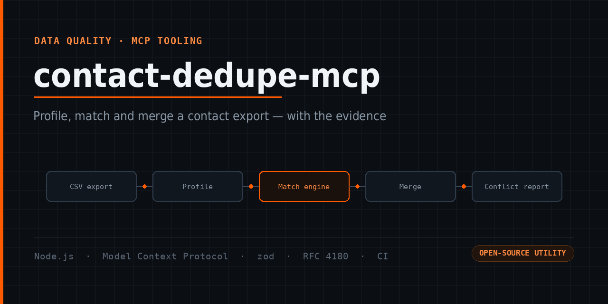

**Business challenge.** Every CRM or Google Contacts export I am handed contains the
same person three or four times — `Ali Raza`, `Raza, Ali`, `Ali R.` — with the phone
number on one row and the email on another. Import that into a new system and the mess
is copied across. Exact-match dedupe misses most of it; fuzzy name matching alone
merges two different people who share a surname.

**System built.** An MCP server that lets Claude (or any MCP client) profile the
export, find the rows that are the same person *with the evidence for each match*,
merge them, and report every conflicting value instead of silently picking one.

**Architecture.**

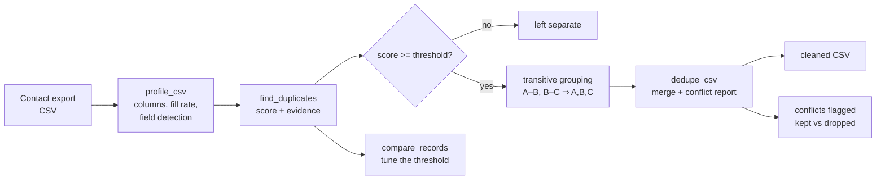

**Stack.** Node.js · Model Context Protocol (stdio) · zod · RFC 4180 CSV reader/writer written in-repo · GitHub Actions

**Engineering highlights.**
- **Evidence, not a verdict.** Every group returns the signals that matched it, so a human can sanity-check before a file is written.
- **Platform-correct email rules.** `Ali.Raza@gmail.com` and `aliraza+crm@gmail.com` are the same mailbox; `a.b@outlook.com` and `ab@outlook.com` are **not** — the dot rule is Gmail behaviour, not a general one.
- **Phone matching on the last nine digits**, so `+92 300 1234567`, `0300-1234567` and `00923001234567` line up without guessing a country.
- **Transitive grouping** — A–B by phone and B–C by email puts all three in one group.
- **Threshold is a parameter**, not a hard-coded constant, and `compare_records` exists to tune it on real pairs.
- **Dry run** before anything is written.
- **Conflicts surfaced, never dropped** — if two rows disagree on company, both values come back.

**Validation.** 9 unit tests over normalisation, scoring, grouping, merge and CSV, plus an end-to-end test that speaks the real stdio protocol against a messy sample file. Both run in CI on Node 20, 22 and 24.

**[View case study →](https://github.com/skmalikllc/contact-dedupe-mcp)**

---

## table-to-sheets `OPEN-SOURCE UTILITY`

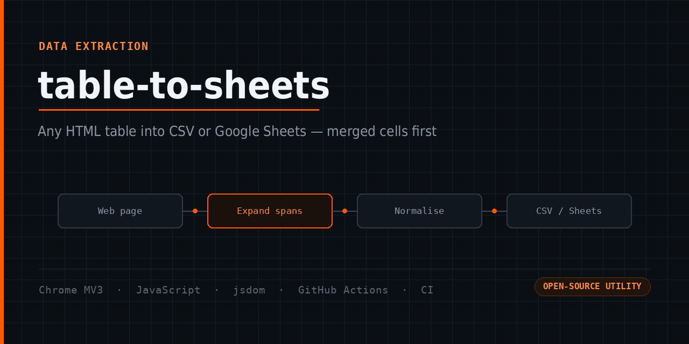

**Business challenge.** Useful data sits in a table on a web page with no export
button. Copying by hand is slow, and the copy-paste tools that exist break on merged
cells: one `rowspan` shifts every following row a column to the left, so the
spreadsheet looks fine until someone sorts it and the numbers are against the wrong
names.

**System built.** A Chrome extension that finds the real data tables on a page,
expands merged cells into a proper rectangle first, and hands the table over as a CSV
download or a clipboard payload that pastes one-value-per-cell into Google Sheets.

**Architecture.**

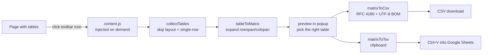

**Stack.** Chrome Extension (Manifest V3) · JavaScript · node:test · jsdom · GitHub Actions

**Engineering highlights.**
- **Merged cells expanded before anything else** — row alignment survives.
- **Layout tables rejected** (a table whose cells contain another table) and single-row tables skipped.
- **RFC 4180 quoting** for commas, quotes and embedded newlines.
- **UTF-8 BOM** so Excel opens Urdu and accented text correctly.
- **Extraction core has zero browser APIs on purpose**, so the awkward parts are unit-testable outside Chrome.
- **No host permissions, no background page, no network calls.**

**Validation.** 7 unit tests covering span expansion, CSV quoting, TSV flattening and table detection, in CI on Node 22 and 24.

**[View case study →](https://github.com/skmalikllc/table-to-sheets)**

---

# Client systems

## n8n Google Contacts Backup `SANITIZED CLIENT CASE STUDY`

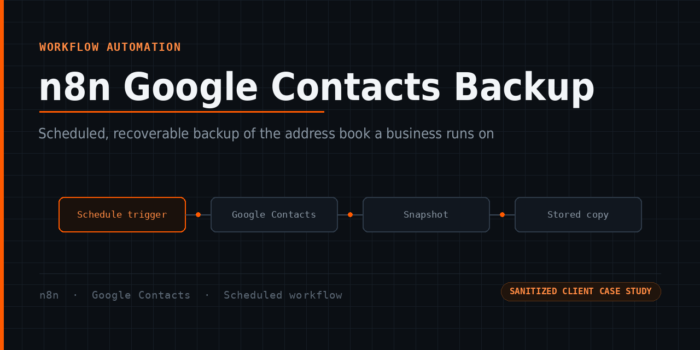

**Business challenge.** Google Contacts has no version history a non-technical owner
can rely on. One bad bulk edit, one bad import, or one sync from a device holding a
stale copy, and the address book the business runs on is changed with no way back.

**System built.** A scheduled n8n workflow that captures the contact list on a
recurring basis, so a bad day is recoverable.

**Architecture** — the shape of the workflow, not its internals:

**Stack.** n8n · Google Contacts · scheduled workflow trigger

**Proof.** Completed Upwork contract, client-rated **5.0**; listed as an Upwork Profile Highlight.

*Implementation details — the node chain, credentials, schedule and destination — are omitted for client confidentiality.*

**[View case study →](https://github.com/skmalikllc/n8n-google-contacts-backup)**

---

## iCloud ↔ Google Contacts Sync `SANITIZED CLIENT CASE STUDY`

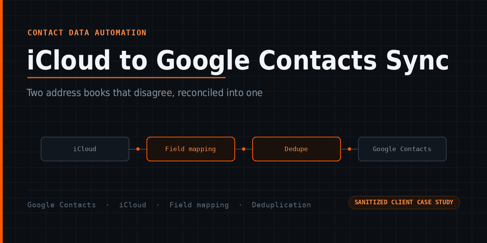

**Business challenge.** A contact list split across iCloud and Google drifts apart.
The phone number is updated on the iPhone, the email in Gmail, and the same person now
exists twice with half the information in each copy. Importing one side into the other
does not fix that — it doubles it.

**System built.** A reconciliation of the two address books: mapping the fields that do
not line up between the platforms, identifying the records that are the same person
across both, and resolving the duplicates rather than importing over the top.

**Architecture.**

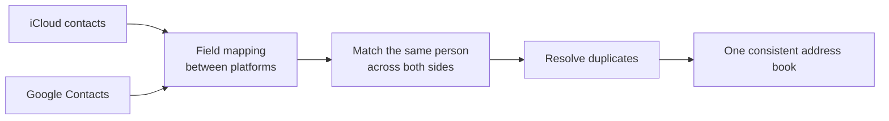

**Stack.** Google Contacts · iCloud · field mapping · deduplication and reconciliation

**Proof.** Completed Upwork contract, client-rated **5.0**.

*The work was performed inside the client's own accounts. No export, mapping table or record set is published.*

**[View case study →](https://github.com/skmalikllc/icloud-google-contacts-sync)**

---

## Google Workspace & Apps Script Automation `SANITIZED CLIENT CASE STUDIES`

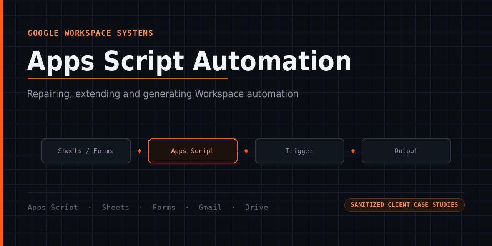

**Business challenge.** A spreadsheet a business runs on rarely stays a spreadsheet.
Someone adds a script to email a summary, or stamp a date, or pull a second sheet in.
That person leaves, the script breaks against a changed column, and nobody left in the
building knows what it was supposed to do.

**Systems built.** Apps Script repaired and extended inside client spreadsheets;
Workspace admin troubleshooting; and a conditional intake form far too large to build
by hand, generated programmatically instead.

**Architecture** — the generated-form system, the most substantial of the four:

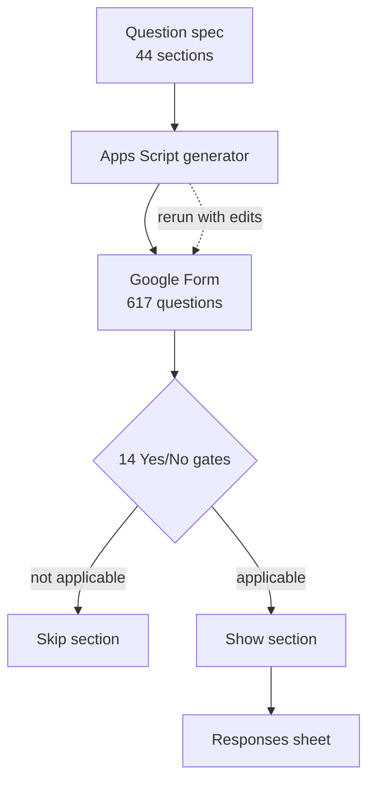

**Stack.** Google Apps Script · Sheets · Forms · Gmail · Drive · Workspace admin

**Engineering highlights.**
- Building the form as a **generator rather than by clicking** makes it reproducible — next year's edition is a rerun with edits, not a rebuild.
- **Conditional routing** so a respondent never sees the 500 questions that do not apply to them.

**Proof.** Completed Upwork contract at **5.0** (Profile Highlight), further Sheets-script work delivered and reviewed on Fiverr, and a Workspace/Gemini export fault diagnosed and fixed.

**[View case study →](https://github.com/skmalikllc/google-workspace-apps-script-automation)**

---

## Cloud File Migration `SANITIZED CLIENT CASE STUDIES`

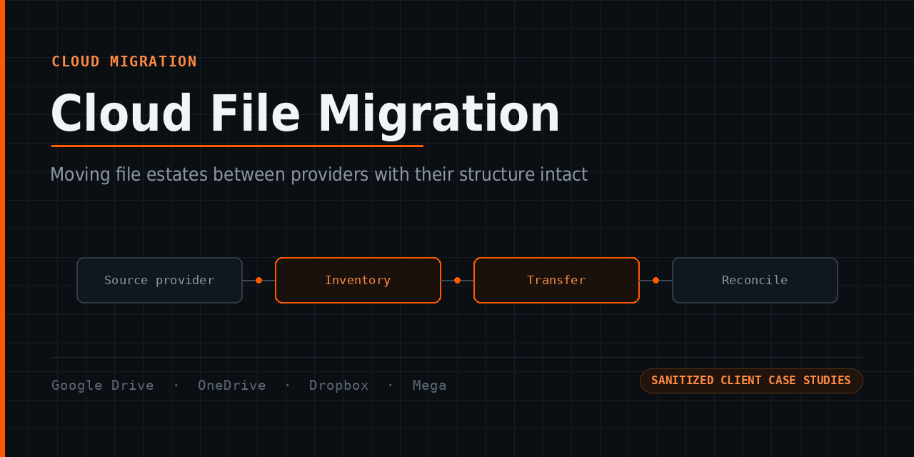

**Business challenge.** Shared drives decay predictably. Files land at the root because
that is where the upload dialog opens. Two people invent two folder schemes. Nobody
deletes anything because nobody is sure what it is. Then the business changes provider
and that mess is what gets copied — often flattened, sometimes renamed, and nobody
notices until the file someone needs is not where it was.

Two failure modes worth naming: a migration that "succeeded" but flattened the
structure, and a sync that faithfully propagates a deletion to the only other copy.

**Systems built.** Provider-to-provider migrations with structure preserved, and file
architecture for drives that stayed where they were.

**Architecture** — the method, applied to every engagement:

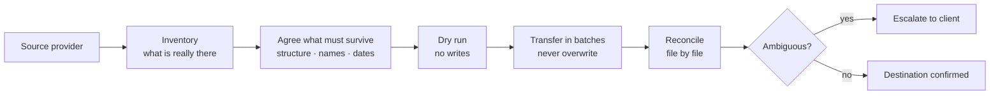

**Stack.** Google Drive · OneDrive · Dropbox · Mega · Google Docs

**Engineering highlights.**
- **Structure preservation is the acceptance criterion**, not byte count.
- **Never overwrite an existing destination file**; ambiguous items are held out of the manifest rather than guessed at.
- **Reconcile after, don't assume** — the tool reporting success is not the same as the result being right.
- **Leave the recovery path intact** until the client confirms.

**Proof.** Mega → Google Drive transfer completed on a **5.0**-rated Upwork contract; further Drive and Dropbox/OneDrive engagements delivered and publicly reviewed on Fiverr; one published Fiverr portfolio project.

**[View case study →](https://github.com/skmalikllc/cloud-file-migration-case-studies)**

---

## Business Mailbox Organization `SANITIZED CLIENT CASE STUDIES`

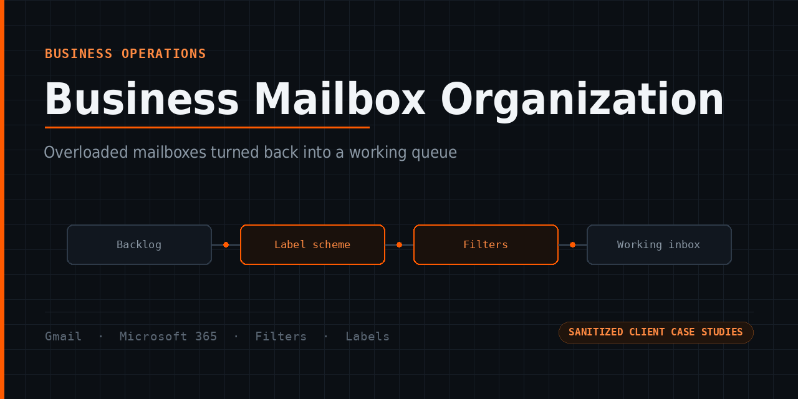

**Business challenge.** A business mailbox running for years without a system ends up
with a large backlog, no usable labels, and real work — a client reply, an invoice, a
supplier confirmation — in the same undifferentiated list as newsletters and platform
notifications. Search becomes the only navigation, so anything the owner cannot
remember the wording of is effectively lost.

**System built.** A label and folder scheme built around how that business actually
works, the backlog moved into it, and filters so incoming mail arrives already sorted
and the inbox stops refilling.

**Architecture.**

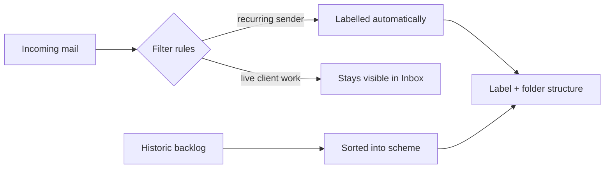

**Stack.** Gmail (labels, filters, search operators, bulk actions) · Microsoft 365 / Outlook · Google Workspace

**Engineering highlights.**
- On one engagement the binding constraint was that **live operational mail had to stay visible in the Inbox** — which rules out the usual "filter everything into folders" approach; the structure had to sit *behind* the inbox, not in front of it.
- **Phased delivery with explicit client sign-off** — on a mailbox near its quota, an unapproved bulk action is not something you can undo.
- **The scheme has to survive handover**: filters keep running, and the owner has to be able to explain the labels to a colleague.

**Proof.** Four Gmail engagements, all 5 stars, turnarounds of 1–9 days; two became ongoing working relationships. Plus a Microsoft 365 engagement and a 250-message verification pass.

**[View case study →](https://github.com/skmalikllc/gmail-business-inbox-organization)**

---

## Jotform Client Intake `SANITIZED CLIENT CASE STUDY`

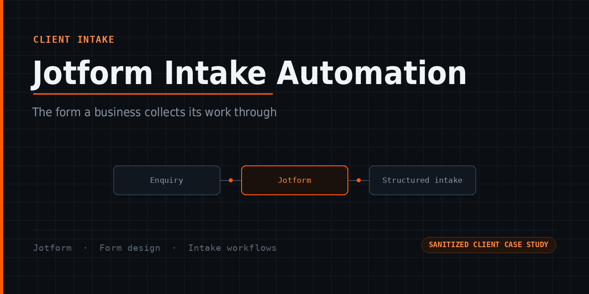

**Business challenge.** Most small businesses collect enquiries through a form set up
once and never revisited: every field required, no branching, submissions landing in a
mailbox nobody has agreed to own. Either the enquiry stalls, or the form is long
enough that people abandon it.

**System built.** Jotform forms built to specification, and the wider forms setup
organised.

**Stack.** Jotform · form design · client intake workflows

**Proof.** Completed Fiverr orders including one in the **$400–$600** range, and a public 5-star client review.

*Downstream integrations are deliberately not claimed — where an engagement included one it belongs to that client's stack, and it is not documented here.*

**[View case study →](https://github.com/skmalikllc/jotform-client-intake-automation)**

---

## Workflow Automation Case Studies `SANITIZED CLIENT CASE STUDIES`

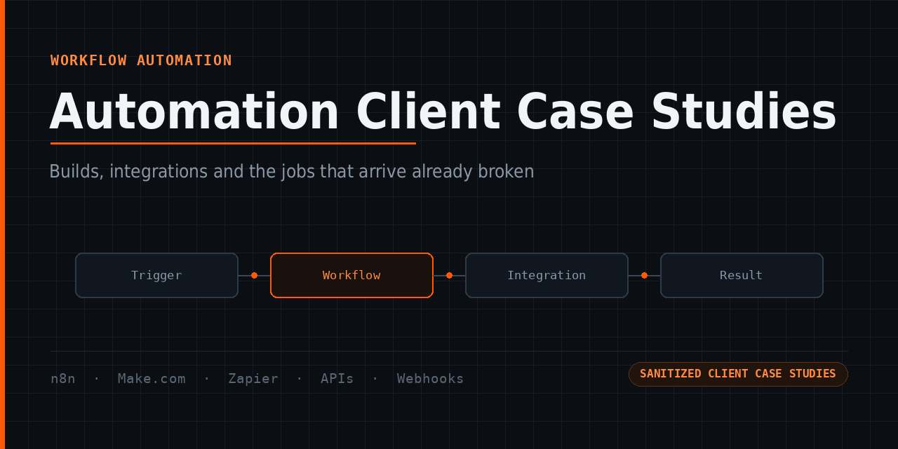

**Business challenge.** Two kinds of job: the workflow that needs building, and the
workflow that used to work and now doesn't.

**Systems built.** n8n, Make and Zapier builds, plus troubleshooting.

**Engineering highlight — the diagnostic that comes up most.** An automation had
stopped firing. The scenario was fine; the fault was a **stale Airtable View ID** —
the view the trigger watched had been replaced, so it was polling something that no
longer existed. That is the shape most "broken automation" jobs take: nothing is wrong
with the logic, something it *refers to* moved, and the platform's error message does
not say so. The fix is tracing the reference, not rebuilding the workflow.

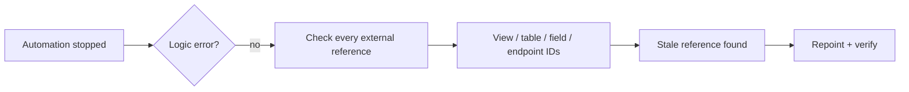

**Stack.** n8n · Make.com · Zapier · Airtable · REST APIs · webhooks

**Proof.** A **5.0**-rated Upwork n8n build delivered ahead of schedule, plus Fiverr automation orders with client reviews.

**[View case study →](https://github.com/skmalikllc/automation-client-case-studies)**

---

## Digital Operations `ENGAGEMENT RECORD`

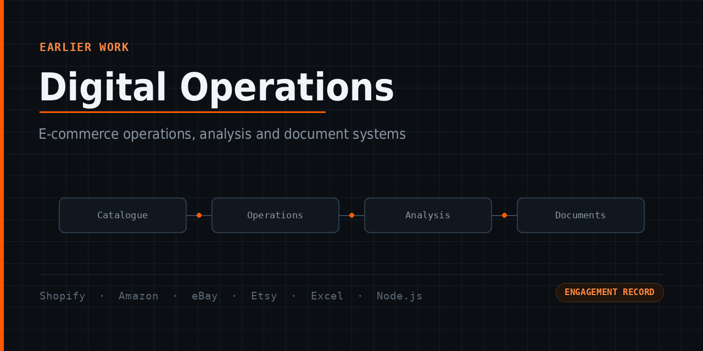

Earlier freelance history — e-commerce operations across Amazon, eBay, Etsy and
Shopify, real-estate support, e-learning setup, staffing cost analysis, a scripted
SOP-to-Word pipeline in Node.js, and an Excel workbook converted into a fully offline
HTML dashboard for an air-gapped PC.

Real and reviewed, kept separate so it does not crowd out the current work.

**[View record →](https://github.com/skmalikllc/digital-operations-portfolio)**

---

# How I design reliable automations

1. **Understand source and destination** before touching either.
2. **Define the source of truth** — one system wins, in writing, before the first run.
3. **Map the fields.** Most integration failures are a mapping assumption, not a bug.
4. **Handle duplicates deliberately.**
5. **Validate inputs** rather than trusting last month's shape.
6. **Test with controlled data**, not the client's live records.
7. **Verify the result** — count it, compare it.
8. **Handle the exceptions**, and stop and ask where something is genuinely ambiguous.
9. **Document the handover** so it survives without me.

On larger builds this extends to retries, idempotent reruns, logging, alerting, a human
approval step and end-of-run reconciliation — where the engagement warranted it. Not
every historical project had all nine, and this page does not claim otherwise.

---

# Track record

| | |
|---|---|
| **Completed freelance engagements** | 200+ |
| **Fiverr** | 221 completed orders · 100% on-time delivery *(account snapshot, Sep 2026)* |
| **Fiverr rating** | **4.9 ★ from 109 reviews** — 107 five-star, 2 four-star *(verified Sep 2026)* |
| **Upwork** | 100% Job Success · Rising Talent · 5 completed contracts, every one **5.0** |
| **Open source** | 2 tools, tests running in CI on every push |

> "Delivered a clean, efficient solution ahead of schedule." — Upwork client · n8n workflow build · Nov 2025

> "Labels, filters, and folders were set up perfectly, saving me a lot of time." — Fiverr client, UK · mailbox organisation · Aug 2026

> "The Jotform was built exactly as requested. Clean layout, smooth functionality." — Fiverr client, Germany · client intake · Aug 2026

> "Drive was organized and really helped me and my team out." — Fiverr client, US · Drive reorganisation · 2025

> "Great to work with. Have done several projects." — repeat Fiverr client, US · Sep 2026

---

# Privacy

No client names, data, exports, credentials, tokens, private URLs, file or folder
names, or proprietary source code appear anywhere in this portfolio. Client quotes are
from reviews published publicly by those clients; usernames are omitted.

---

*Last updated: September 2026.*
